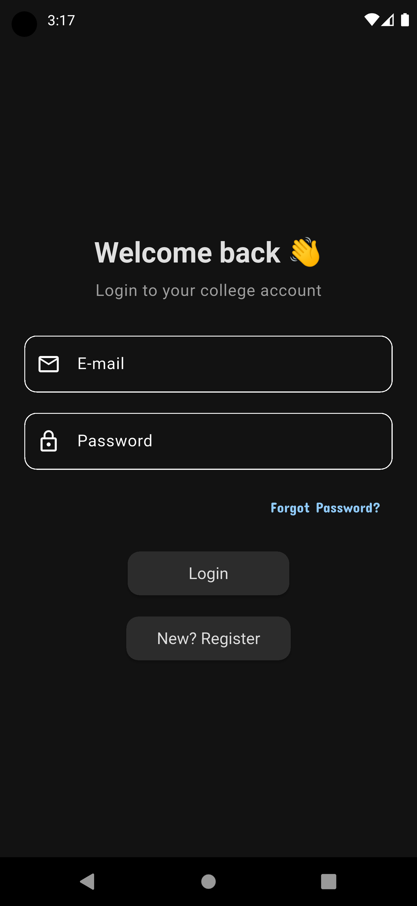
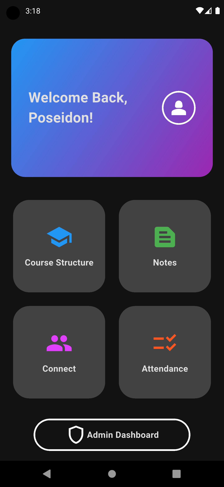
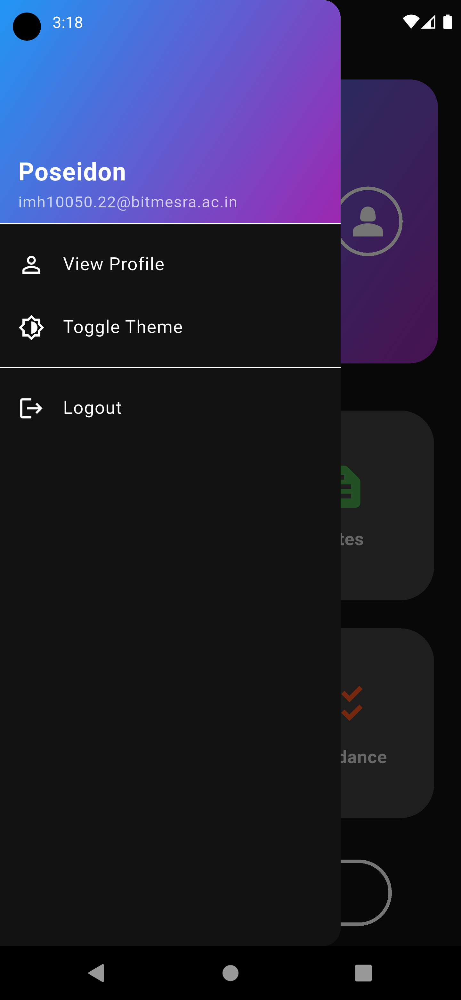
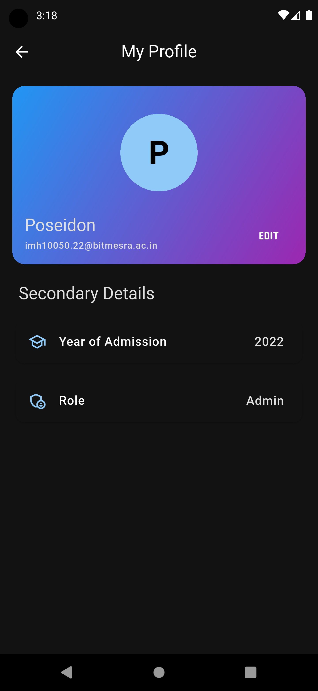
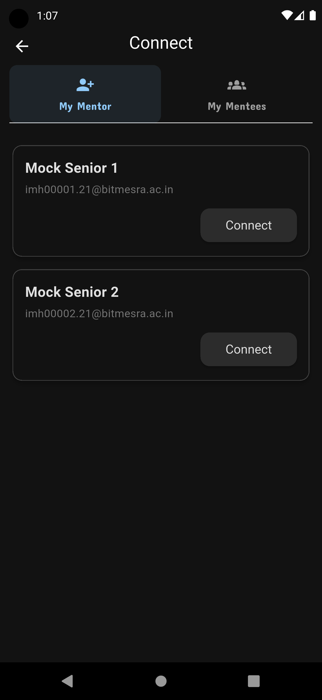
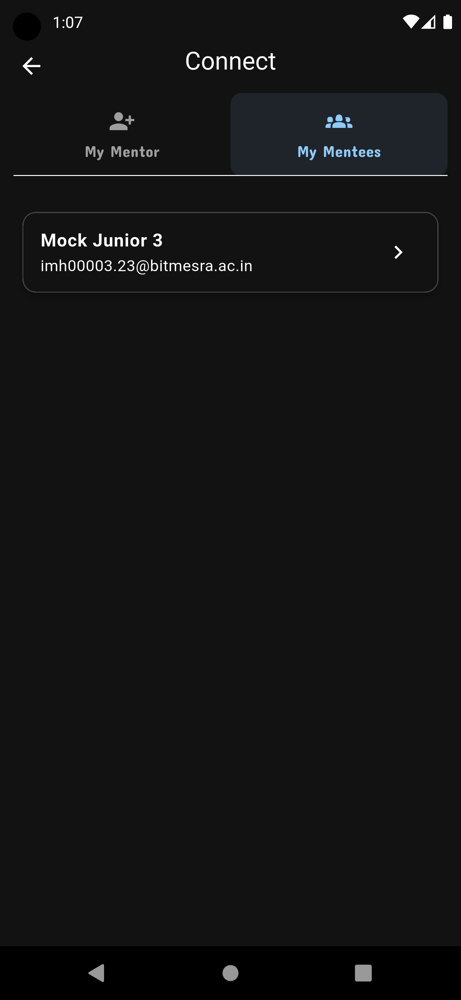
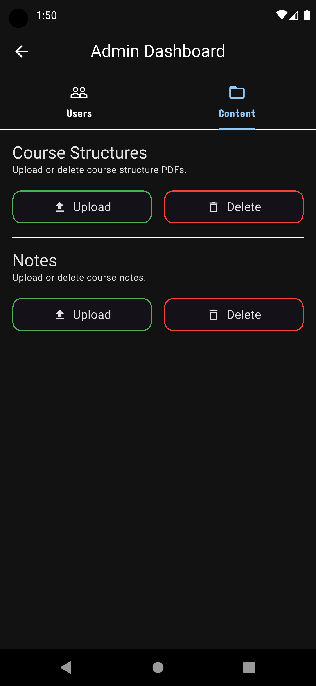

# 🎓 CollegeConnect

A full-stack **College Management System** built with **Flutter** and **Node.js** for seamless interaction between students, mentors, and administrators. The app handles everything from file sharing to mentorship management and real-time communication — structured with secure access control and modular design.

## 🚀 Features

- 🔐 **JWT Authentication** with access + refresh tokens
- 🎭 **Role-based Access Control** — students, mentors, and admins
- 🗂️ **Notes Upload & Download** with Cloudinary integration
- 📚 **Course Management** with dynamic admin controls
- 🧑‍🏫 **Mentor-Mentee Connect** system (assignments + chat)
- 💬 **One-to-One Chat System** (WIP)
- 📱 **Flutter Frontend** with Bloc for reactive state management
- 🌐 **Express Backend** with MongoDB and RESTful API design

## 🛠️ Tech Stack

### Frontend:
- Flutter
- Dart
- Bloc (State Management)

### Backend:
- Node.js
- Express.js
- MongoDB + Mongoose
- JSON Web Tokens (JWT)
- Multer + Cloudinary (for file handling)

### Tools:
- Postman for API testing
- MongoDB Atlas for cloud DB
- GitHub Actions (optional for CI/CD)

## 🧑‍💻 Project Structure

```
CollegeConnect/
│
├── backend/                  # Node.js + Express backend
│   ├── controllers/          # Logic for routes
│   ├── models/               # Mongoose schemas
│   ├── routes/               # API endpoints
│   ├── middleware/           # Auth, error handling
│   └── utils/                # Helper functions (e.g., Cloudinary)
│
├── frontend/                 # Flutter app
│   ├── lib/
│   │   ├── blocs/            # Bloc structure for each screen
│   │   ├── screens/          # Home, Profile, Courses, Notes, Connect, etc.
│   │   ├── services/         # API services
│   │   ├── models/           # Data models
│   │   └── widgets/          # Reusable UI widgets
│
└── README.md
```

## 📷 Screenshots

<p align="center">
  
  
  
  
</p>
<p align="center">
  
  
  
  
  
</p>
<p align="center">
  
</p>

## 📦 API Highlights

| Endpoint                  | Method | Access  | Description                      |
|--------------------------|--------|---------|----------------------------------|
| `/api/auth/register`     | POST   | Public  | Register a new user              |
| `/api/auth/login`        | POST   | Public  | Login and get tokens             |
| `/api/course/`           | GET    | Public  | Fetch available courses          |
| `/api/notes/upload`      | POST   | Student | Upload notes with PDF file       |
| `/api/mentor/connect`    | POST   | Student | Request a mentor                 |
| `/api/admin/toggleAdmin` | PUT    | Admin   | Promote/demote junior admins     |

_(More routes documented inside the code)_

## ✅ Future Enhancements

- ✅ Real-time one-to-one messaging (WebSockets)
- ✅ Notification system
- ✅ Student Analytics Dashboard
- ✅ Search + Filter on Notes & Courses

## 🧪 Setup Instructions

### Backend

```bash
cd backend
npm install
# Setup .env with MONGO_URI, JWT_SECRET, CLOUDINARY_KEYS, etc.
npm run dev
```

### Frontend

```bash
cd frontend
flutter pub get
flutter run
```

## 🙌 Credits

Made with ❤️ by [@ThunderSpear21](https://github.com/ThunderSpear21)

## 📄 License

This project is licensed under the MIT License.